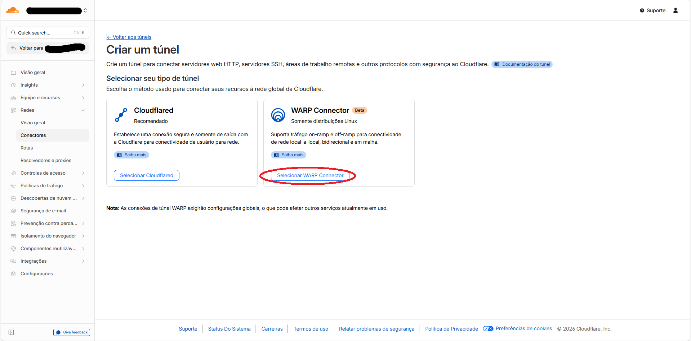
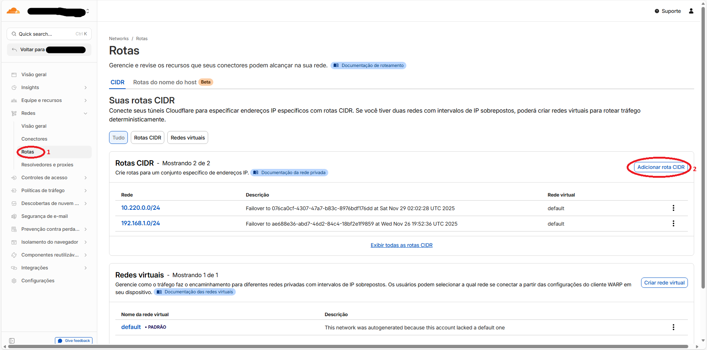
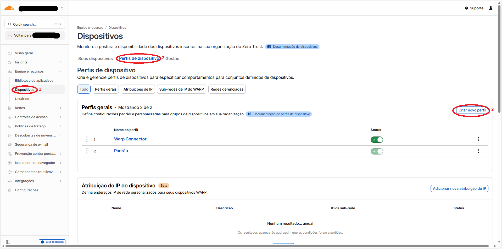
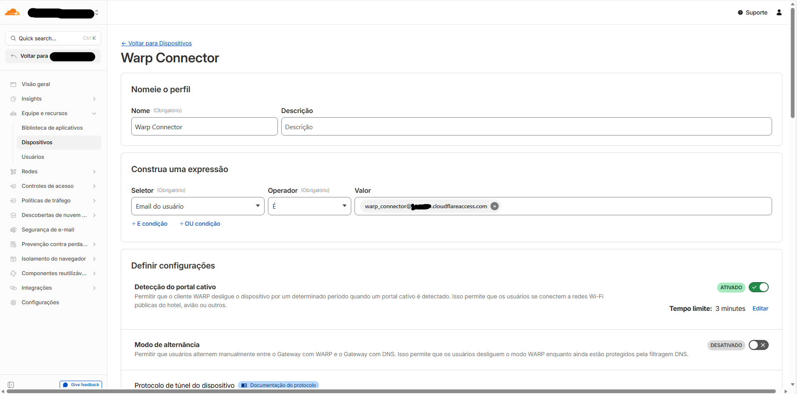
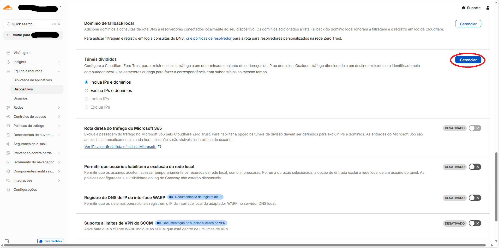
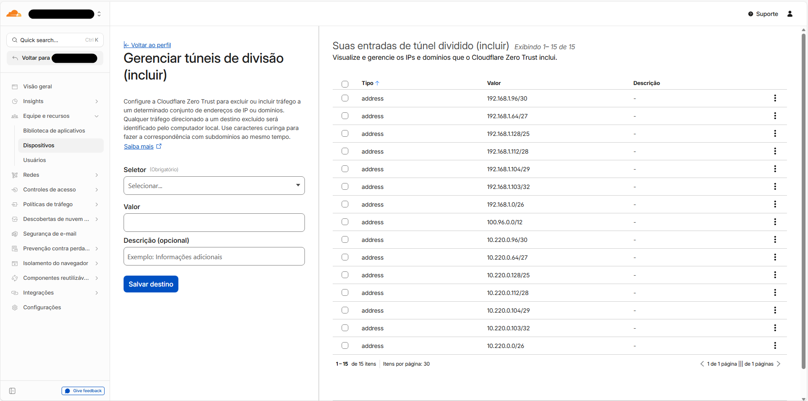

# Rede HA entre Clusters com Cloudflare WARP Connector e Keepalived

## Objetivo
- Conectar sub-redes distintas via Cloudflare WARP Connector para comunicação entre clusters K3s
- Prover IP virtual por cluster com Keepalived (VRRP) para alta disponibilidade dos conectores WARP
- Estabelecer conectividade confiável entre clusters com failover automático via API Cloudflare
- Base Debian 12 (Bookworm) com 2 maquinas conectoras por cluster (ca-warp-connector-01/02 e cb-warp-connector-01/02)
- Implementar atualização automática de rotas Cloudflare durante eventos de failover

## Topologia
- Cluster A: ca-warp-connector-01 e ca-warp-connector-02 (Keepalived + WARP), VIP: ca-warp-connector-vip
- Cluster B: cb-warp-connector-01 e cb-warp-connector-02 (Keepalived + WARP), VIP: cb-warp-connector-vip
- Tráfego inter-cluster encapsulado na rede global Cloudflare
- Cada cluster possui 3 masters e 3 workers além dos 2 conectores WARP

## Pré-requisitos
- **Sistema Operacional**: Debian 12 (Bookworm) atualizado em todas as VMs conectoras
- **Acesso**: Conta com privilégios sudo nas máquinas em todas as maquinas
- **Rede**: Interfaces de rede configuradas com IPs estáticos e conectividade entre as VMs
- **Cloudflare**: Conta Cloudflare com acesso ao Zero Trust (necessário para criar túneis e rotas)
- **Ferramentas**: curl, jq e outros pacotes básicos instalados
- **Configuração DNS**: Entradas /etc/hosts configuradas conforme exemplo abaixo

### Configurar Hosts em /etc/hosts de todas as maquinas
```bash
# Hosts do Cluster A 
<IP_CLUSTER_A_MASTER01> ca-master-01
<IP_CLUSTER_A_MASTER02> ca-master-02
<IP_CLUSTER_A_MASTER03> ca-master-03
<IP_CLUSTER_A_WORKER01> ca-worker-01
<IP_CLUSTER_A_WORKER02> ca-worker-02
<IP_CLUSTER_A_WORKER03> ca-worker-03
<IP_CLUSTER_A_WARP_CONNECTOR_A1> ca-warp-connector-01
<IP_CLUSTER_A_WARP_CONNECTOR_A2> ca-warp-connector-02
<VIP_CLUSTER_A_KUBEAPI> ca-kube-apiserver-vip
<VIP_CLUSTER_A_WARP> ca-warp-connector-vip
# Hosts do Cluster B
<IP_CLUSTER_B_MASTER01> cb-master-01
<IP_CLUSTER_B_MASTER02> cb-master-02
<IP_CLUSTER_B_MASTER03> cb-master-03
<IP_CLUSTER_B_WORKER01> cb-worker-01
<IP_CLUSTER_B_WORKER02> cb-worker-02
<IP_CLUSTER_B_WORKER03> cb-worker-03
<IP_CLUSTER_B_WARP_CONNECTOR_A1> cb-warp-connector-01
<IP_CLUSTER_B_WARP_CONNECTOR_A2> cb-warp-connector-02
<VIP_CLUSTER_B_KUBEAPI> cb-kube-apiserver-vip
<VIP_CLUSTER_B_WARP> cb-warp-connector-vip
```

### Atualização inicial

```bash
sudo apt update
sudo apt -y upgrade
sudo reboot
```

## Instalação do Cloudflare WARP Connector

### Configuração no Cloudflare Zero Trust
1. Acesse o painel de controle do Cloudflare Zero Trust
2. Vá para **Redes** → **Conectores** e crie túneis para cada máquina que funcionará como warp connector
3. Siga as instruções de instalação mostradas para cada máquina
4. Em **Redes** → **Rotas**, configure as rotas para a rede de cada cluster
5. Em **Equipe e recursos** → **Dispositivos**, crie um Perfis de dispositivo para a malha de cluster, o mesmo deve incluir a subnet da cloudflare 100.64.0.0/10 e da rede de ambos os clusters com a excessão dos ips do VIP dos Warp Connectors e as proprias maquinas conectoras.










## Instalação do Keepalived (VRRP)

### Configurações de Exemplo

As configurações abaixo são baseadas nos arquivos reais localizados em `warp-connectors-keepalived/`.

```bash
sudo apt -y install keepalived
```

### Script de checagem do WARP (Baseado no arquivo real)
- Usado para influenciar prioridade VRRP
- Localizado em: `/warp-connectors-keepalived/check_warp.sh`

```bash
sudo tee /etc/keepalived/check_warp.sh >/dev/null <<'EOF'
#!/bin/bash
/usr/bin/warp-cli status | grep -q "Connected"
exit $?
EOF
sudo chmod +x /etc/keepalived/check_warp.sh
```

### Configuração Keepalived (Baseada nas configurações reais)

#### Configuração MASTER em ca-warp-connector-01 (Cluster A)
- Arquivo base: `/warp-connectors-keepalived/keepalived-master/keepalived.conf`
- Prioridade: 100 (maior prioridade)
- Estado: MASTER

```bash
sudo tee /etc/keepalived/keepalived.conf >/dev/null <<'EOF'
global_defs {
    script_security
}

vrrp_script check_warp {
    script "/etc/keepalived/check_warp.sh"
    interval 2
    weight -60
    fall 2
    rise 2
}

vrrp_instance VI_1 {
    state MASTER
    interface eth0
    virtual_router_id 51
    priority 100
    advert_int 1
    authentication {
        auth_type PASS
        auth_pass 123456
    }
    virtual_ipaddress {
        <VIP_CLUSTER_A_WARP>/32
    }
    track_script {
        check_warp
    }
    notify "/etc/keepalived/failover-api.sh"
}
EOF
```

#### Configuração BACKUP em ca-warp-connector-02 (Cluster A)
- Arquivo base: `/warp-connectors-keepalived/keepalived-backup/keepalived.conf`
- Prioridade: 50 (menor prioridade)
- Estado: BACKUP

```bash
sudo tee /etc/keepalived/keepalived.conf >/dev/null <<'EOF'
global_defs {
    script_security
}

vrrp_script check_warp {
    script "/etc/keepalived/check_warp.sh"
    interval 2
    weight -60
    fall 2
    rise 2
}

vrrp_instance VI_1 {
    state BACKUP
    interface eth0
    virtual_router_id 51
    priority 50
    advert_int 1
    authentication {
        auth_type PASS
        auth_pass 123456
    }
    virtual_ipaddress {
        <VIP_CLUSTER_A_WARP>/32
    }
    track_script {
        check_warp
    }
    notify "/etc/keepalived/failover-api.sh"
}
EOF
```

### Configuração para o Cluster B

O processo para o Cluster B é análogo. Você deve configurar o Keepalived em `cb-warp-connector-01` (como MASTER) e `cb-warp-connector-02` (como BACKUP), realizando os seguintes ajustes nos arquivos de configuração:

- **`virtual_router_id`**: Altere para um valor único para o Cluster B (ex: `52`) para evitar conflitos com o Cluster A.
- **`virtual_ipaddress`**: Use o VIP do Cluster B (`<VIP_CLUSTER_B_WARP>`).

### Ativação e verificação

```bash
sudo systemctl enable keepalived
sudo systemctl restart keepalived
sudo systemctl status keepalived --no-pager
ip addr show eth0  # Verificar se o VIP está ativo
```

## Failover Automático via API Cloudflare

### Configuração de Credenciais e Scripts

#### Arquivo de credenciais (api-credentials.conf)
- Localizado em: `/warp-connectors-keepalived/api-credentials.conf`
- **Importante**: Este arquivo deve ser criado em todos os quatro nós conectores (`ca-warp-connector-01/02` e `cb-warp-connector-01/02`).
- Configure as credenciais do Cloudflare, ajustando `TUNNEL_ID_LOCAL` para o ID do túnel correspondente a cada máquina.

```bash
sudo tee /etc/keepalived/api-credentials.conf >/dev/null <<'EOF'
#!/bin/bash
API_TOKEN="<TOKEN_API_CLOUDFLARE>" # Token de API Cloudflare
ACCOUNT_ID="<CLOUDFLARE_ACCOUNT_ID>" # ID da conta Cloudflare
TUNNEL_ID_LOCAL="<ID_TUNNEL_CLOUDFLARE_WAP>" # ID do túnel Cloudflare WARP (específico para esta máquina)
SUBNET="<CLUSTER_SUBNET>"  # Sub-rede em HA (ex: 10.220.0.0/24)
VIP="<CLUSTER_WARPCONNECTOR_VIP>"  # VIP gerenciado pelo Keepalived (ex: 10.220.0.100)
ROUTE_ID="<ID_ROUTE_CLOUDFLARE_WAP>"  # ID da rota no Cloudflare Zero Trust referente a rede do Cluster
EOF
```

#### Script de failover (failover-api.sh)
- Localizado em: `/warp-connectors-keepalived/failover-api.sh`
- Atualiza rotas via API Cloudflare quando há failover

```bash
sudo tee /etc/keepalived/failover-api.sh >/dev/null <<'EOF'
#!/bin/bash

# Carregar variáveis de configuração
source /etc/keepalived/api-credentials.conf

# Log para depuração
echo "Script failover-api.sh chamado em $(date)" | tee -a /var/log/failover.log

# Função para atualizar a rota via PATCH
update_route() {
    local route_id=$1
    local tunnel_id=$2

    echo "Tentando PATCH para route_id=$route_id, tunnel_id=$tunnel_id" | tee -a /var/log/failover.log
    RESPONSE=$(curl -s -X PATCH "https://api.cloudflare.com/client/v4/accounts/$ACCOUNT_ID/teamnet/routes/$route_id" \
        -H "Authorization: Bearer $API_TOKEN" \
        -H "Content-Type: application/json" \
        --data "{\"tunnel_id\": \"$tunnel_id\", \"network\": \"$SUBNET\", \"comment\": \"Failover to $tunnel_id at $(date)\"}")

    if echo "$RESPONSE" | jq -r '.success' | grep -q "true"; then
        echo "Rota atualizada para túnel $tunnel_id em $(date)" | tee -a /var/log/failover.log
    else
        ERROR=$(echo "$RESPONSE" | jq -r '.errors[] // "Sem detalhes de erro"')
        echo "Erro ao atualizar rota com Bearer token: $ERROR" | tee -a /var/log/failover.log
        # Fallback para X-Auth-Email e X-Auth-Key
        echo "Tentando PATCH com X-Auth-Email/X-Auth-Key..." | tee -a /var/log/failover.log
        RESPONSE=$(curl -s -X PATCH "https://api.cloudflare.com/client/v4/accounts/$ACCOUNT_ID/teamnet/routes/$route_id" \
            -H "X-Auth-Email: $CLOUDFLARE_EMAIL" \
            -H "X-Auth-Key: $CLOUDFLARE_API_KEY" \
            -H "Content-Type: application/json" \
            --data "{\"tunnel_id\": \"$tunnel_id\", \"network\": \"$SUBNET\", \"comment\": \"Failover to $tunnel_id at $(date)\"}")
        if echo "$RESPONSE" | jq -r '.success' | grep -q "true"; then
            echo "Rota atualizada com X-Auth-Email/X-Auth-Key para túnel $tunnel_id em $(date)" | tee -a /var/log/failover.log
        else
            ERROR=$(echo "$RESPONSE" | jq -r '.errors[] // "Sem detalhes de erro"')
            echo "Erro ao atualizar rota com X-Auth-Email/X-Auth-Key: $ERROR" | tee -a /var/log/failover.log
        fi
    fi
}

# Verifica se WARP está conectado e se este servidor é o MASTER (tem o VIP)
echo "Verificando WARP e VIP..." | tee -a /var/log/failover.log
WARP_STATUS=$(/usr/bin/warp-cli status | grep Connected || echo "WARP não conectado")
VIP_STATUS=$(ip addr show | grep "$VIP" || echo "VIP $VIP não encontrado")
echo "WARP_STATUS: $WARP_STATUS" | tee -a /var/log/failover.log
echo "VIP_STATUS: $VIP_STATUS" | tee -a /var/log/failover.log

if [ "$WARP_STATUS" = "Status update: Connected" ] && [ "$VIP_STATUS" != "VIP $VIP não encontrado" ]; then
    # Somente se for MASTER: Buscar detalhes da rota
    echo "Servidor é MASTER (VIP presente). Buscando detalhes da rota $ROUTE_ID para $SUBNET..." | tee -a /var/log/failover.log
    CURRENT_ROUTE=$(curl -s -X GET "https://api.cloudflare.com/client/v4/accounts/$ACCOUNT_ID/teamnet/routes/$ROUTE_ID" \
        -H "Authorization: Bearer $API_TOKEN" \
        -H "Content-Type: application/json")

    CURRENT_TUNNEL_ID=$(echo "$CURRENT_ROUTE" | jq -r '.result.tunnel_id')
    ROUTE_NETWORK=$(echo "$CURRENT_ROUTE" | jq -r '.result.network')

    echo "CURRENT_TUNNEL_ID=$CURRENT_TUNNEL_ID, ROUTE_NETWORK=$ROUTE_NETWORK" | tee -a /var/log/failover.log
    if [ "$ROUTE_NETWORK" = "$SUBNET" ] && [ "$CURRENT_TUNNEL_ID" != "$TUNNEL_ID_LOCAL" ]; then
        echo "Rota atual está em $CURRENT_TUNNEL_ID, atualizando para $TUNNEL_ID_LOCAL..." | tee -a /var/log/failover.log
        update_route "$ROUTE_ID" "$TUNNEL_ID_LOCAL"
    else
        echo "Rota já está correta ($TUNNEL_ID_LOCAL) ou não corresponde à sub-rede $SUBNET em $(date)." | tee -a /var/log/failover.log
    fi
else
    echo "Servidor não é MASTER (VIP ausente) ou WARP não conectado. Nenhuma ação realizada em $(date)." | tee -a /var/log/failover.log
    exit 0
fi
EOF

sudo chmod +x /etc/keepalived/failover-api.sh
```
- Ping VIPs entre clusters pelo túnel Cloudflare

```bash
ping -c 4 ca-warp-connector-vip  # VIP do Cluster A
ping -c 4 cb-warp-connector-vip  # VIP do Cluster B
```

## Verificação de Logs

```bash
# Verificar logs do failover
tail -f /var/log/failover.log

# Verificar status do Keepalived
sudo systemctl status keepalived --no-pager

# Verificar se o VIP está ativo
ip addr show | grep ca-warp-connector-vip
```

## Considerações
- Garantir rotas e firewall permitindo tráfego entre VIPs
- Manter faixas de pods/serviços dos clusters sem sobreposição