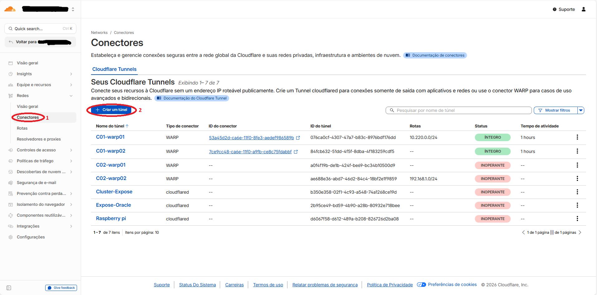
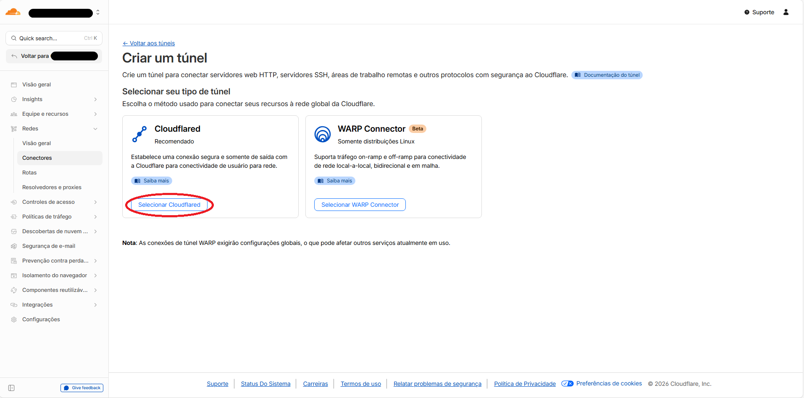
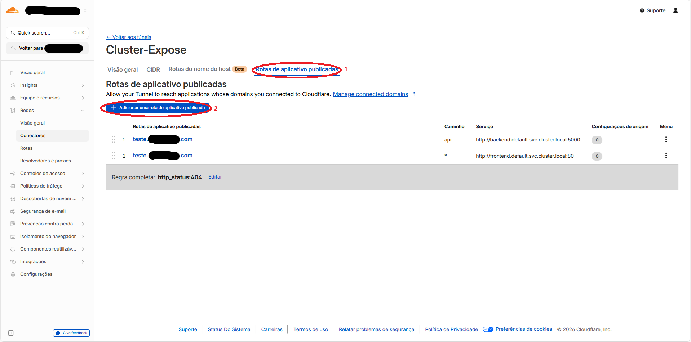

# Exposição Segura da aplicação de exemplo via Cloudflare Tunnel (cloudflared)

## Objetivo
- Publicar a aplicação de exemplo do TCC de forma segura
- Usar Cloudflare Tunnel com cloudflared como Deployment
- Expor a aplicação HA (frontend/backend) através do Cloudflare Tunnel

## Pré-requisitos
- Conta Cloudflare e Tunnel criado
- Token do Tunnel
- Domínio configurado no Cloudflare
- Aplicação exemplo já implantada nos clusters (ver manifestos em `manifests/example-app/`)
- kubectl configurado com contextos para ambos os clusters

## Crie um Tunnel no Cloudflare do tipo Cloudflared Tunnel

1. **Acesse o painel Cloudflare**
   - Vá até [https://dash.cloudflare.com](https://dash.cloudflare.com)
   - Faça login com sua conta Cloudflare

2. **Navegue até a seção de Tunnels**
   - Vá para **Access** → **Tunnels** (ou **Redes** → **Conectores** em algumas versões)
   - Clique em **Create a tunnel**

3. **Configure o novo tunnel**
   - Nome do tunnel: `k3s-cluster-tunnel`
   - Tipo: **Cloudflared**
   - Clique em **Save tunnel**

4. **Obtenha o token do tunnel**
   - Após criar o tunnel, você verá um comando de instalação
   - Copie apenas o token (a parte após `--token` no comando)
   - Exemplo de token: `eyJhIjoiY2xvdWRmbGFyZS10b2tlbi1leGVtcGxvLWV4ZW1wbG8ifQ==`

5. **Configure o roteamento no painel Cloudflare**
   - No mesmo local onde você criou o tunnel, vá para a aba **Public Hostname**
   - Clique em **Add a public hostname**
   - **Subdomain**: `app` (ou o nome que desejar)
   - **Domain**: Seu domínio configurado no Cloudflare
   - **Service Type**: HTTP
   - **Service URL**: `frontend.default.svc.cluster.local:80`
   - Clique em **Save hostname**





## Deploy da Aplicação Exemplo

Antes de configurar o Cloudflare Tunnel, certifique-se de que a aplicação está rodando nos clusters. A aplicação consiste em:

- **PostgreSQL**: Banco de dados com replicação entre clusters
- **Backend**: API REST em Python/Flask
- **Frontend**: Interface web em React

### Deploy no Cluster A (Principal)
```bash
# Aplicar manifestos do banco de dados (master)
kubectl apply -f manifests/example-app/01-postgres-master.yaml --context=k3s-cluster-a

# Verificar se o PostgreSQL está rodando
kubectl get pods -l app=postgres --context=k3s-cluster-a
kubectl logs -l app=postgres --context=k3s-cluster-a

# Aplicar manifestos da aplicação
kubectl apply -f manifests/example-app/04-backend-frontend-c1.yaml --context=k3s-cluster-a

# Verificar status
kubectl get pods --context=k3s-cluster-a
kubectl get svc --context=k3s-cluster-a
```

### Deploy no Cluster B (Secundário)
```bash
# Aplicar réplicas do PostgreSQL
kubectl apply -f manifests/example-app/02-postgres-replicas-c1.yaml --context=k3s-cluster-b
kubectl apply -f manifests/example-app/03-postgres-replicas-c2.yaml --context=k3s-cluster-b

# Verificar replicação
kubectl get pods -l app=postgres --context=k3s-cluster-b

# Aplicar manifestos da aplicação
kubectl apply -f manifests/example-app/06-backend-frontend-c2.yaml --context=k3s-cluster-b

# Verificar status
kubectl get pods --context=k3s-cluster-b
kubectl get svc --context=k3s-cluster-b
```

### Testar conectividade entre clusters
```bash
# Testar se o serviço frontend está acessível internamente
kubectl run test-curl --image=curlimages/curl --rm -it --restart=Never -- /bin/sh -c "curl -s http://frontend.default.svc.cluster.local"

# Verificar se o backend está respondendo
kubectl run test-backend --image=curlimages/curl --rm -it --restart=Never -- /bin/sh -c "curl -s http://backend.default.svc.cluster.local:5000/health"
```

## Deployment de Cloudflared

### 1. Criar o arquivo de deployment do cloudflared

Crie um arquivo `cloudflared-deployment.yaml` com o seguinte conteúdo:

```yaml
apiVersion: apps/v1
kind: Deployment
metadata:
  name: cloudflared
  namespace: default
spec:
  replicas: 3  # Alta disponibilidade com múltiplas réplicas
  selector:
    matchLabels:
      app: cloudflared
  template:
    metadata:
      labels:
        app: cloudflared
    spec:
      containers:
      - name: cloudflared
        image: cloudflare/cloudflared:latest
        args:
        - tunnel
        - --no-autoupdate
        # Habilita o servidor de métricas para que o Liveness Probe funcione
        - --metrics
        - "0.0.0.0:20241"
        - run
        - --token
        - <TunnelToken>  # Substitua pelo seu token real
        
        # === MELHORIA 1: Forçar HTTP2 ===
        env:
        - name: TUNNEL_TRANSPORT_PROTOCOL
          value: "http2"
        
        # === MELHORIA 2: Auto-Recuperação (Liveness Probe) ===
        livenessProbe:
          httpGet:
            path: /ready
            port: 20241
          initialDelaySeconds: 15
          periodSeconds: 10
          failureThreshold: 3
        
        # === MELHORIA 3: Limites de Recursos ===
        resources:
          requests:
            memory: "128Mi"
            cpu: "100m"
          limits:
            memory: "256Mi"
            cpu: "200m"
        
        # === MELHORIA 4: Security Context ===
        securityContext:
          allowPrivilegeEscalation: false
          readOnlyRootFilesystem: true
          runAsNonRoot: true
          runAsUser: 65534  # nobody user
```

### 2. Substituir o token e aplicar o deployment

```bash
# Substitua <TunnelToken> pelo seu token real usando sed
sed -i 's/<TunnelToken>/SEU_TOKEN_AQUI/g' cloudflared-deployment.yaml

# Aplicar no cluster principal (onde está o frontend)
kubectl apply -f cloudflared-deployment.yaml --context=k3s-cluster-a

# Verificar se o deployment foi criado corretamente
kubectl get deployment cloudflared --context=k3s-cluster-a
kubectl get pods -l app=cloudflared --context=k3s-cluster-a
```

### 3. Verificar logs e conectividade

```bash
# Verificar logs do cloudflared
kubectl logs -l app=cloudflared --context=k3s-cluster-a -f

# Verificar se o tunnel está conectado
kubectl exec -it deployment/cloudflared --context=k3s-cluster-a -- /bin/sh -c "curl -s http://localhost:20241/metrics | grep tunnel_connected"
```